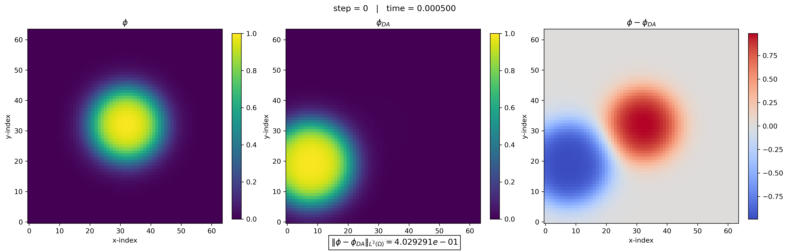
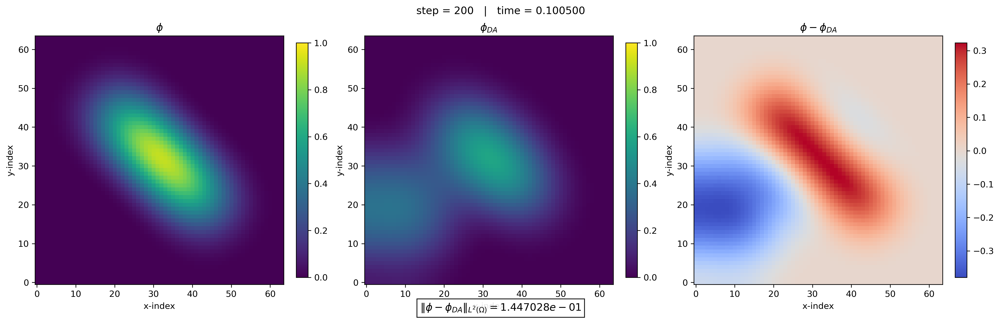
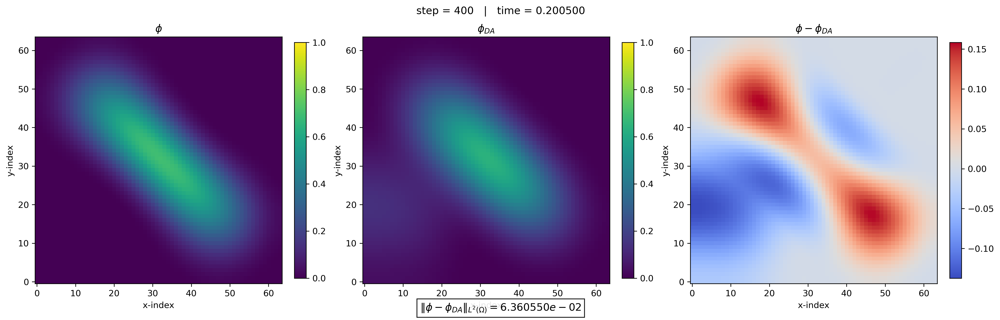
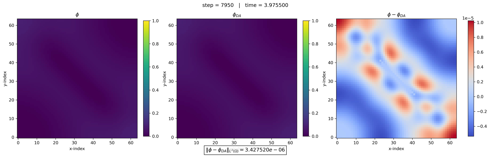
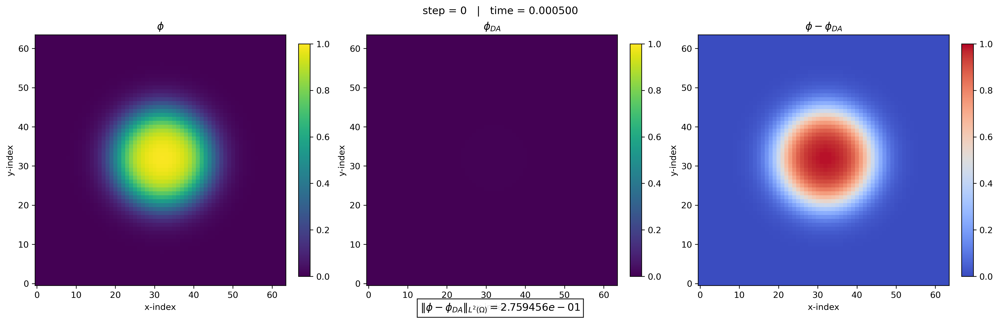
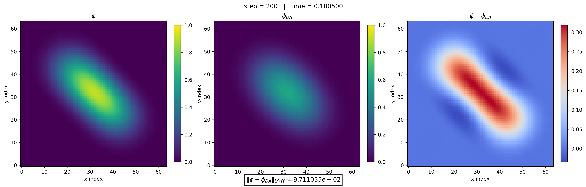
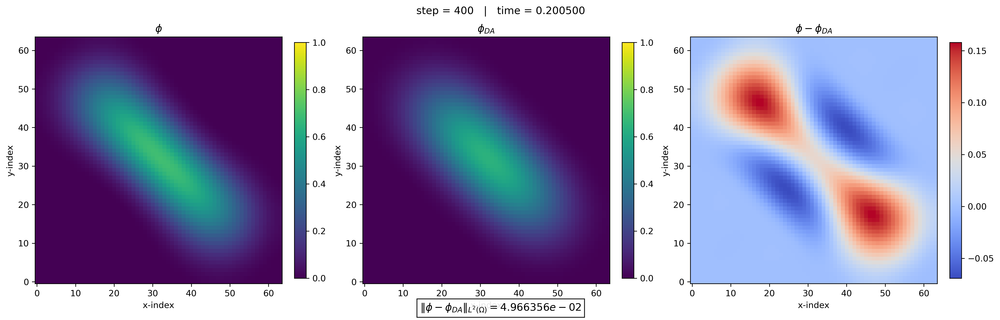
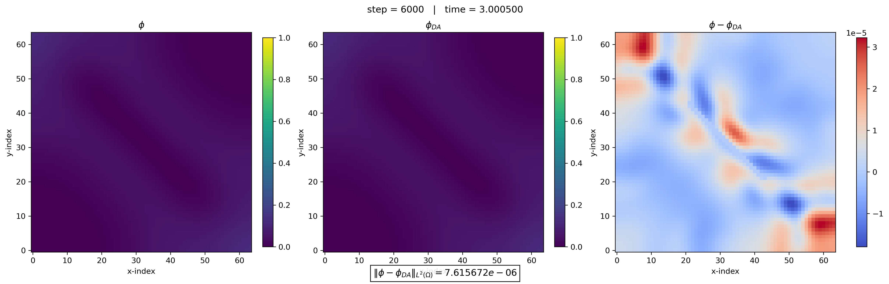
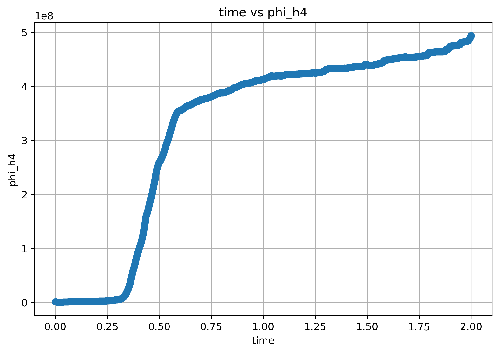

# Data_assimilation

This repository studies a data assimilation framework for a phase-field model of thrombus formation and blood flow.

## Model description

The governing system is based on the phase-field model introduced in *Local Well-Posedness of a Three-Dimensional Phase-Field Model for Thrombus and Blood Flow* by Woojeong Kim, Krutika Tawri, and Roger Temam.

In the present work, the original model is modified by adding an additional diffusion term.

The original model is:

```math
\rho\left(\frac{\partial u}{\partial t} + u \cdot \nabla u\right)
+ \nabla p
- \nabla \cdot \left(\eta(\phi)\nabla u\right)
=
-\lambda \nabla \cdot (\nabla \phi \otimes \nabla \phi)
+ \nabla \cdot \left(\lambda_e (1-\phi)(F F^T - I)\right)
- \eta(\phi)\frac{(1-\phi)u}{\kappa(\phi)}
```

```math
\nabla \cdot u = 0
```

```math
\frac{\partial F}{\partial t} + u \cdot \nabla F = \nabla u \, F
```

```math
\frac{\partial \phi}{\partial t} + u \cdot \nabla \phi = \tau \Delta \mu
```

```math
\mu = -\lambda \Delta \phi + \lambda \gamma f'(\phi)
- \frac{\lambda_e}{2}\mathrm{tr}(F F^T - I)
```


# Physics-Informed Data Assimilation for Multiphysics PDE Systems

This project develops a physics-informed data assimilation framework for recovering hidden dynamics in complex multiphysics PDE systems under limited observational data.

The framework combines:

- phase-field multiphysics modeling,
- spectral PDE solvers,
- nudging-based data assimilation,
- sparse observation recovery,
- and stability-aware numerical reconstruction.

The proposed method was tested on Diffusion-enhanced nonlinear Navier–Stokes–Cahn–Hilliard-type systems with coupled deformation dynamics.

---

# Key Features

## Physics-informed state reconstruction

The framework reconstructs latent PDE states from partial low-resolution observations using nudging-based data assimilation.

Unlike standard supervised learning pipelines, the method preserves:

- PDE consistency,
- physical constraints,
- energy structure,
- and long-time dynamical behavior.

---

## Sparse observation recovery

Only low Fourier modes were used as observable measurements:

- 9×9 modes,
- 33×33 modes,

while the full PDE dynamics evolved on higher-resolution spectral solvers.

Despite limited observations, the assimilated solution successfully synchronized with the reference dynamics.

---

## Robust recovery under uncertain initialization

The framework was validated in two distinct operational scenarios:

### 1. Known initial state initialization

The assimilated system was initialized close to the reference dynamics.

Results demonstrated:

- stable synchronization,
- rapid mismatch decay,
- reliable state tracking,
- and long-time numerical stability.

This setting corresponds to systems where partial prior state information is available.

#### Example Results

<p align="center">
  
  
  
  
</p>

---

### 2. All-zero initial state recovery

The assimilated system was initialized using completely different dynamics.

Even without access to the true initial condition, the framework successfully reconstructed the target dynamics from observational measurements alone.

This demonstrates:

- robustness to initialization uncertainty,
- stability under large initial mismatch,
- and reliable recovery from sparse measurements.

This scenario is particularly relevant for:

- inverse problems,
- scientific machine learning,
- digital twin reconstruction,
- and real-world monitoring systems with incomplete state information.

#### Example Results

<p align="center">
  
  
  
  
</p>

---

# Numerical Infrastructure

The computational framework includes:

- Fourier spectral PDE solvers,
- semi-implicit time integration,
- low-mode interpolation operators,
- error tracking pipelines,
- H²/H⁴ norm diagnostics,
- energy decomposition monitoring,
- and manufactured-solution verification tests.

The framework was designed to support:

- reproducible scientific ML experiments,
- stability benchmarking,
- and scalable PDE-constrained learning workflows.

---

# Validation Metrics

The following diagnostics were monitored throughout the assimilation process:

- relative L² reconstruction error,
- mismatch decay,
- divergence error,
- mass conservation,
- energy evolution,
- H²/H⁴ regularity diagnostics,
- and long-time stability behavior.

The numerical experiments confirmed stable and effective synchronization between the assimilated and reference solutions.

---


---

# Demonstration Video

A video demonstration of the data assimilation and reconstruction process is available below.

[Watch Simulation Video](https://drive.google.com/file/d/1M5t7s8J5-oIzSTag0kTn5RGXmLXo6upb/view?usp=drive_link)

The video illustrates:

- synchronization between reference and assimilated solutions,
- sparse-observation recovery,
- long-time dynamical behavior,
- and stability of the reconstruction framework.

---

# High-Order Regularity Diagnostics

To monitor long-time numerical stability and solution regularity, the H⁴ norm evolution of the phase variable was tracked throughout the simulation.

The H⁴ diagnostic provides insight into:

- high-frequency behavior,
- regularity growth,
- numerical stability,
- and stiffness evolution of the multiphysics PDE system.

<p align="center">
  
</p>

The diagnostic confirms that the framework maintains stable high-order numerical behavior during long-time integration and data assimilation.


# Scientific ML and Simulation AI Perspective

This work can be viewed as a PDE-constrained reconstruction framework for recovering hidden multiphysics dynamics from sparse observations.

Potential extensions include:

- scientific machine learning,
- operator learning,
- surrogate modeling,
- uncertainty-aware simulation,
- PDE-constrained AI systems,
- digital twin simulation,
- patient-specific hemodynamics,
- and sparse-data inverse problems.

---

# Future Work

Future directions include:

1. Time-dependent non-steady-state reference dynamics.
2. Well-posedness analysis for the nudged coupled PDE system.
3. Channel-flow and realistic boundary condition configurations.
4. Assimilation using real observational data:
   - clot shape measurements,
   - platelet concentration fields,
   - fibrin transport data,
   - patient-specific hemodynamics.
5. Parameter estimation using data assimilation techniques.

---
### Clone

```bash
git clone https://github.com/woooojng/data_assimilation.git
```
## Usage

### Train the model at clonned directory in terminal:

```bash
python3 spectral_video.py
```

# Author

Woojeong Kim  
Indiana University Bloomington  
Applied Mathematics / Scientific Machine Learning / PDE Systems
